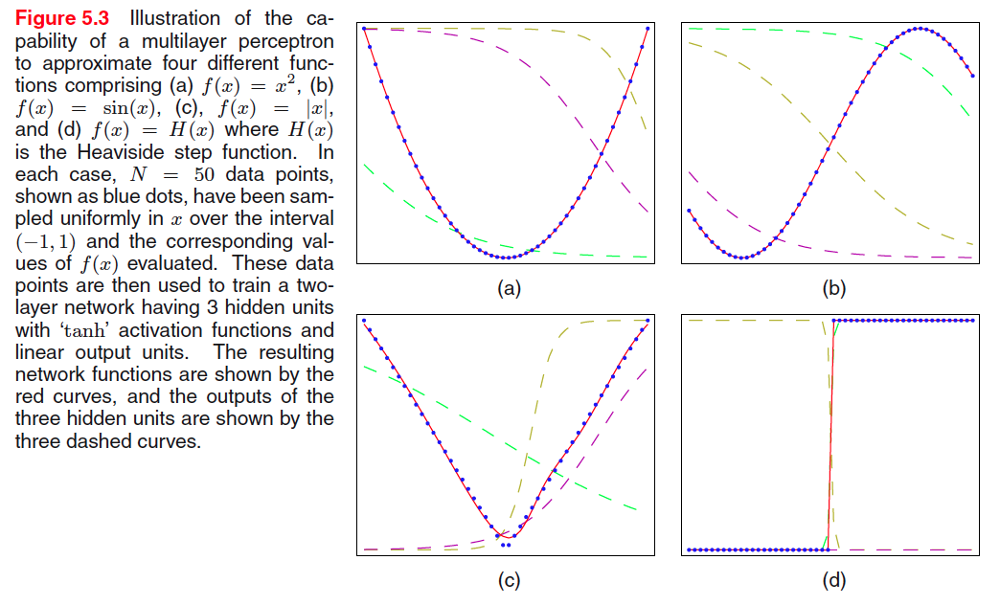
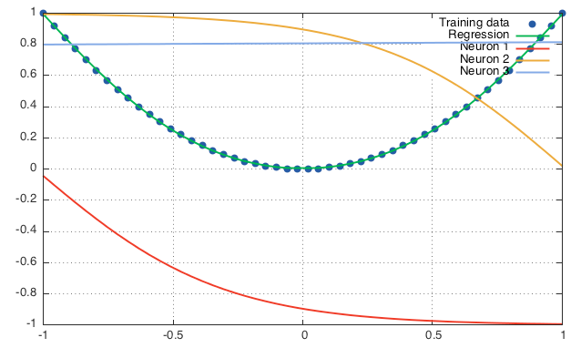
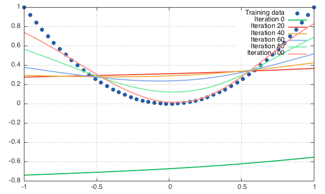
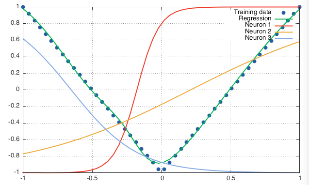

# Regression with MLP

Reading Bishop's [*Pattern Recognition and Machine Learning*](http://research.microsoft.com/en-us/um/people/cmbishop/prml/), I got to the point in which a 3-layer [MLP](http://en.wikipedia.org/wiki/Multilayer_perceptron) with **only 3 hidden neurons** (and 1 output linear neuron) was used to regress seamlessly some continuous functions. Here's the image



## Figure 5.3(a)
Therefore, I wanted to reproduce these results, starting from 5.3(a). Notice that *f*_a : [−1,+1] → [0,+1], *x* ↦ *x*² whereas **tanh** : ℝ → [−1,+1], but it looks like **tanh** : ℝ → [0,+1]. Therefore, I assume a scaling and shifting factor have been applied to the *tanhs* in order to make them look better on the paper (or *f*_a(*x*) = (√2 *x*)² − 1).

### MLP and neurons' outputs
Running [`src/regression.lua`](src/regression.lua) with `plotIntermediateResults = false` and `maxIteration = 1e4` produces the following result



Here we can see the output of the 3 hidden neurons and how they are linearly combined to produce the *regression* of the input function. Notice that, in this specific case, only two hidden neurons are actually contributing to the output since the one with constant output has the same contribution of a bias term.

### Transient
The script [`src/regression.lua`](src/regression.lua) can also be run with `plotIntermediateResults = true` and `maxIteration = 1e2`. In this way we can monitor the progress of the training algorithm in its early iterations (i.e. its *transient response*) and see how the convergence is reached.




### Run the script
Running the script is pretty simple. All you need is to read the instruction at the top of the [file](src/regression.lua) and run *Torch* interactively.

```bash
th -i regression.lua
```

### The algorithm
The majority of [`src/regression.lua`](src/regression.lua) is visualisation stuff. The algorithmic part is pretty small and simple. I will report it here as well, for clarity and reference.

```lua
-- Define dataset --------------------------------------------------------------
dataset = {}
function dataset:size() return 50 end
x = torch.linspace(-1,1,dataset:size())
y = x:clone():pow(2)
for i = 1, dataset:size() do
   dataset[i] = {x:reshape(x:size(1),1)[i], y:reshape(y:size(1),1)[i]}
end

-- Define model architecture ---------------------------------------------------
model = nn.Sequential()
model:add(nn.Linear(1,3))
model:add(nn.Tanh())
model:add(nn.Linear(3,1))

-- Trainer definition ----------------------------------------------------------
criterion = nn.MSECriterion()
trainer = nn.StochasticGradient(model, criterion)
trainer.learningRate = 0.01

-- Training --------------------------------------------------------------------
trainer:train(dataset)
```

## Figure 5.3(b)
Here is clear, again, that the function sin(*x*) has been manipulated. And, precisely, *f*_b(*x*) = sin(2.5∙*x*). Therefore, by choosing the case (b) in the code (i.e. commenting out the other function definitions, as explained in the script itself) we can proceed and run it with *Torch7*.

### MLP and neurons' outputs
Picking again `plotIntermediateResults = false` and `maxIteration = 1e4` produces decent results


### The algorithm
The only difference is in the creation of the `dataset`, which now is built with a different `y`

```lua
y = torch.sin(x * 2.5) 
```

## Figure 5.3(c)
Here we are dealing with out first function ∉ 𝒞¹. More specifically, *f*_c(*x*) = |2∙*x*| − 1 and we are trying to approximate it with a linear combination of 3 𝒞¹ functions.

### MLP and neurons' outputs
For this reason we need a higher number of iterations, let's say `maxIteration = 1e5`. Hence, after having commented out what needs to be, we can get the following result


