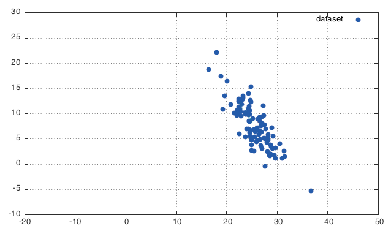
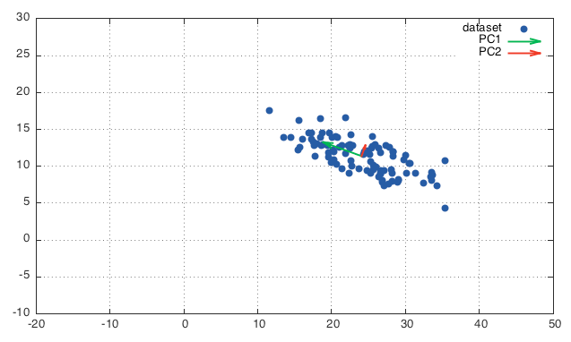
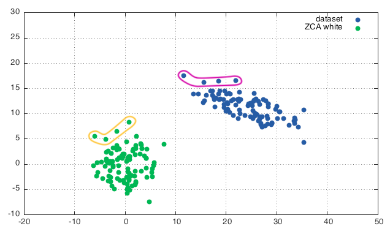

# PCA
[*Principal component analysis*](http://en.wikipedia.org/wiki/Principal_component_analysis) (*PCA*) finds the directions of greatest variance in a dataset.

## Index
 - [Why do we care?](#why-do-we-care)
 - [How does it work?](#how-does-it-work)
 - [What is used for?](#what-is-used-for)
    - [Dimensionality reduction](#dimensionality-reduction)
    - [Acquiring knowledge of variance distribution](#acquiring-knowledge-of-variance-distribution)
 - [Reducing data dimensionality](#reducing-data-dimensionality)
    - [Conclusion](#conclusion)
    - [Run the script](#run-the-script)
    - [The algorithm](#the-algorithm)
 - [Data spherification](#data-spherification)
    - [Run the script](#run-the-script-1)
    - [The algorithm](#the-algorithm-1)
 - [Data augmentation by aligned perturbation](#data-augmentation-by-aligned-perturbation)
    - [Introduction](#introduction)
    - [Example](#example)
    - [Justification](#justification)

## Why do we care?
PCA can do a great deal of useful things such as:

 - speed up training;
 - 2/3D representation of data living in *n*-D, *n* > 3;
 - data augmentation by aligned perturbation;
 - ZCA whitening.

It can of course as well screw up everything (see [Feldman's blog post](http://blog.explainmydata.com/2012/07/should-you-apply-pca-to-your-data.html), for example).

## How does it work?
To find the *first component*, PCA looks for a **linear combination of the elements of your dataset's vectors, which explains the highest variation of the data**. Think of it as the *versor* on which, the projection (*dot product*) of the dataset will have its highest variability.
For the *second component*, PCA looks for another (linear) combination — i.e. another *versor* — **orthogonal to the first one**, which explains the second highest variation of the data.
For the third, same story. In this case, the elements's combination has to be vertical to all previously found one. Etc…

## What is used for?

### Dimensionality reduction
For each *versor*, *principal component* or *eigenvector* there is an associated *power* (or *energy*, if square rooted), *variance* (or *standard deviation*, if square rooted) or *eigenvalue* which tells us the "amount of variability" in that direction. What happens often is that only the first few components have non-neglectable variance. Hence, data dimensionality can be greatly reduced with little loss of information.
In turn, dimensionality reduction can be used to perform a series of tricks, such as *training speed-up* and *2/3D visualisation of high dimensional data* I mentioned above.

### Acquiring knowledge of variance distribution
Knowing the *direction* and the *amount* of variance of our data allows us, by playing smartly with them, to achieve reasonable *data augmentation* and *data spherificatoin*. More about it will be said later, in these notes.

## Reducing data dimensionality
OK, let's get our hands dirty with PCA.  
So, after all this chatting, let's get a bit more specific with a case study.
Let's think we have a data living in a 2D space — with an uneven distribution — we'd like to compress into 1D, i.e. onto a line.
So, this is how the data looks like



This data is said to be *correlated*. This means that the value of one component influence the other component, hence both component are "important". Let's run PCA


```lua
eigenvectors (colums):
-0.5488  0.8359
 0.8359  0.5488
[torch.DoubleTensor of dimension 2x2]

eigenvalues (power/variance):
 27.2135
  2.3272
[torch.DoubleTensor of dimension 2]

sqrt of the above (energy/std):
 5.2167
 1.5255
[torch.DoubleTensor of dimension 2]
```
Great. Now we have the direction of highest variability (1st component) and its orthogonal one.  
If we consider the data in its new reference system (represented by the two principal components), we can say it is *uncorrelated*. Losely speaking, this means that one component does not influence the value of the other component.  
Let's look at the text output. Here we can see that the total *energy* / *information* of `5.44` (= √[`27.2` + `2.33`]) is spread unevenly across the components. `5.22` on the first and `1.53` on the second one. This means that, if we project the dataset onto the first component and discard the second one, we would retain 92.1% (= `27.2`/[`27.2` + `2.33`]) of the *variance*.
OK, it looks like cool. Let's project


Great! Now we have data along only 1 dimension which have a variability very close to the original data.
Notice how the "spare datapoint" at south-east in the original data is mapped on the far-west in the projected replica. This is because the "green arrow" of the first component is pointing on the opposite direction, hence the projection will be "very negative".
Notice also the 5 datapoints at north-west in the original data, are eavenly separated in the far-east projected data.

### Conclusion
Cool. Now we know how to reduce data dimensionality. In turn, this means we can speed up our training (by using less input data) and we are able to visualise data living in high-D onto 3/2/1D.

### Run the script
Running the script is pretty simple. All you need is to read the instruction at the top of the file and run Torch interactively.

```
th -i PCA.lua
```

### The algorithm
The script I've used so far is [`src/PCA.lua`](src/PCA.lua). *PCA* and *projection* are shown below.

```lua
-- PCA -------------------------------------------------------------------------
-- X is m x n
mean = torch.mean(X, 1) -- 1 x n
m = X:size(1)
Xm = X - torch.ones(m, 1) * mean
Xm:div(math.sqrt(m - 1))
v,s,_ = torch.svd(Xm:t())
s:cmul(s) -- n

-- Projection ------------------------------------------------------------------
X_hat = (X - torch.ones(m,1) * mean) * v[{ {},{1} }] -- m x 1
```

`X`, a `m` × `n` matrix, contains our dataset by rows; in this case `m` = `100` and `n` = `2`, i.e. we have `100` `2`-dimensional datapoints. `X_hat` is our projected data onto the *first component* `v[{ {},{1} }]`.

## Data spherification
This framework we just build could be also useful for illustrating *ZCA whitening* or *data spherificatoin*.  
First of all, what the heck is "data spherification"? Well, in easy terms, it means redistribute data (along its principal components) in a way such that the variance is constant, i.e. minimum correlation. This makes sense **only** if the data components are generated by close parents. Otherwise, you just take a ticket for the doom way (see [Feldman's blog post](http://blog.explainmydata.com/2012/07/should-you-apply-pca-to-your-data.html), for example). This tecnhique is useful for "stripping off" the data all the "rubbish information" that won't supposedly help the job of other algorithms down the pipeline.  
This said, let's get our cucumber-blob to reseable more a tomatoe-blob, starting with a new dataset and its PCA



Its *standard deviations* are `5.51` and `1.54`. We can rotate the data by evaluating the projection on both *principal components* and dividing it by the corresponding standard deviation obtaining, therefore, *PCA whitening*. (For sake of visualisation, I've multiplied the data by 3, obtaining hence std of `3` per component.)


Note how the "rotated data" is also "flipped" (for ease of spotting this, I've highlighten a group of four datapoints that have a particular L-shape). This happens because the second principal component happened to be on the "negative side" of a "standard" positively oriented reference system (i.e. it's at 90° clockwise rotation from the first component). Therefore, in order to put things to their right place and keep the original meaninig of each component, we ought to rotate back the data into its original reference system.



### Run the script
The script is the same as above. The only thing you need to do is to enable the visualisation of *ZCA*, and tweak the sphere radius, if you so desire. So, open the script [`src/PCA.lua`](src/PCA.lua), read the instruction and change the code accordigly.

### The algorithm
What *ZCA* implies is: (1) rotate the data onto its principal components, (2) normalise the variance, (3) rotate back to the original reference system. In Torch's terms

```lua
-- ZCA / spherification / whitening -------------------------------------------- 
X_rot = (X - torch.ones(m,1) * mean) * v
X_PCA_white = X_rot * torch.sqrt(s):pow(-1):diag()
X_ZCA_white = X_PCA_white * v:t()
```

## Data augmentation by aligned perturbation

### Introduction
What does this bombastic title stay for? Well, the concept behind it is actually quite simple.  
Put yourself in the situation in which your learning algorithm is *overfitting* the dataset, i.e. it's learning the inherent distribution of the *training dataset* and won't generalise well for the *testing one*. Therefore, you'd like to artificially augment your training dataset by adding some noise in a "smart" way. E.g, you could add centred (`0`-mean) small (`0.2`-std) Gaussian noise along the data principal components scaled by the square root of the corresponding eigenvalues. In this way, the "general trend" is preserved and the new fictitious observation will be quite plausible.

### Example
Let's get our hands on, to get an understanding out of this nice concept.  
Let our dataset be the pixels of a colour (`3` channels) image of `96` rows and `128` columns.


Here the pixels are aligned on a plane in a specific order constituting what we call *image*. Let's throw them into a 3D space letting their colour components' values determine their position. Here they are (if you run the code you will have the chance of rotating the 3D scatter plot and have a better idea of the pixels' 3D distribution).


Now we can compute the principal components (as said before, if you run the script you'll be able to change the point of view using the mouse, which will help understand the distribution's shape and the position of the new reference system).


Hence, we can add a small amount of centred Gaussian noise along to the principal component directions, scaled by the corresponding standard deviation. Here's how the recontructed image looks like for `12` different draws of the random variable.


### Justification
Someone may argue about why introducing all this framework if, at the end, we simply use "random values". Well… the results of using spherical random values (in contrast to our ellipsoidal approach) is the following.


It is undeniable that *aligned perturbation* produces far more credible results. What happens is that the component that has greater spread will eventually "move" much more than those that are more localised, in terms of colour space coordinates.  
In this specific case — as we can see from our 3D pixels distribution's scatter plots — the major component closely approximates the *brightness* channel, i.e. the oriented line that gose from (`0`,`0`,`0`) to (`255`,`255`,`255`), even though it is oriented in the opposite direction. Therefore, the highest perturbation will occur in terms of brightness variability, which won't affect the overall appearance of the image, due our *brightness visual invariancy*. Furthermore, all perturbations are compliant with the "data distribution shape", hence the output will look more "natural".
